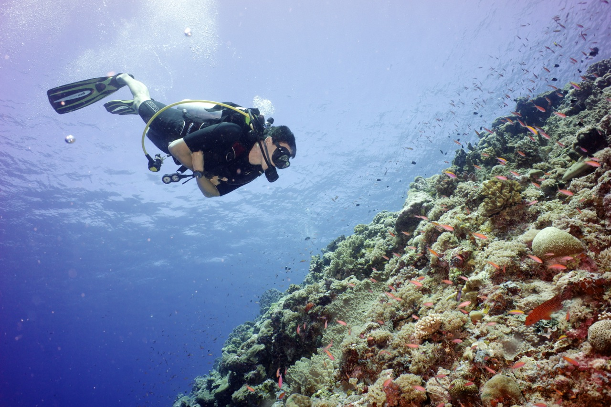

# Bienvenido a Environmental Computing

### Iniciando con R, manipulación de datos, gráficos y estadísticas para las ciencias ambientales

Los estudiantes e investigadores en las ciencias ambientales requieren una amplia gama de habilidades cuantitativas en software analítico y de procesamiento de datos, incluyendo R, sistemas de información geográfica (GIS) y el procesamiento de datos remotos. Cada vez hay más necesidad de garantizar la transparencia del procesamiento de datos respaldado por análisis estadísticos para justificar conclusiones de investigación científica y monitoreo para la gestión y política. Este sitio es una breve introducción a las técnicas de organización de datos, gráficos y análisis estadísticos.

